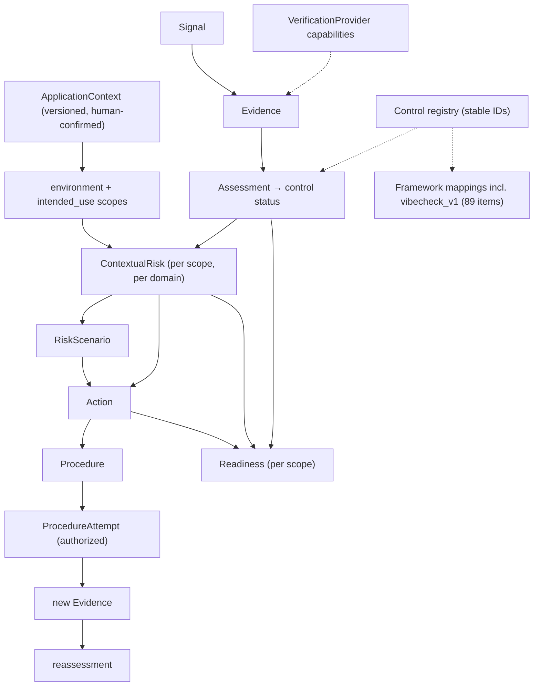
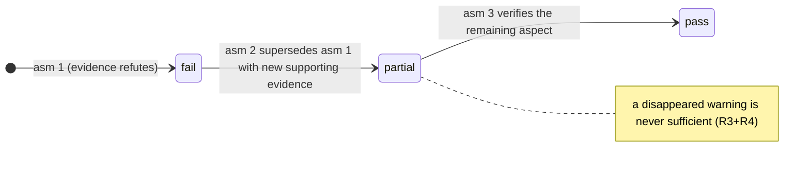
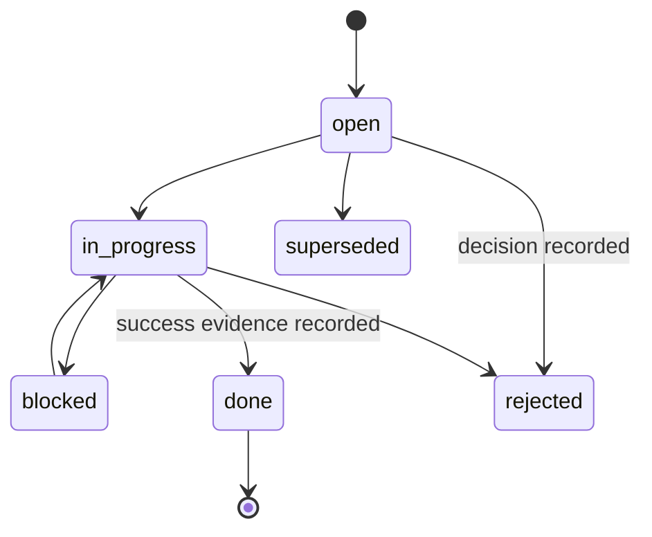

# RFC 0001 — Assessment, risk, evidence and execution schema v1

| | |
|---|---|
| Status | Draft for review |
| Issue | [#2](https://github.com/jaakla/vibecheck/issues/2), under epic [#1](https://github.com/jaakla/vibecheck/issues/1) |
| Schema | [`schema/vibecheck.assessment.v1.schema.json`](../schema/vibecheck.assessment.v1.schema.json) |
| Risk method | [`schema/risk-matrix.v1.json`](../schema/risk-matrix.v1.json) + [`schema/risk-derivation.v1.json`](../schema/risk-derivation.v1.json) |
| Context model | [`schema/vibecheck.context.v1.json`](../schema/vibecheck.context.v1.json) |
| Examples | [`schema/examples/`](../schema/examples/), [`tests/golden/`](../tests/golden/) |
| Tests | [`tests/test_rfc_schema.py`](../tests/test_rfc_schema.py), [`tests/test_canonical.py`](../tests/test_canonical.py), [`tests/test_context.py`](../tests/test_context.py) |

This RFC defines the versioned domain contract for context-aware, risk-based, actionable
Vibecheck assessments. It is the normative design dependency for every implementation
increment under epic #1.

Implementation status: Increment 1 (#3) shipped the envelope, the stable control IDs and
the legacy adapters. Increment 2 (#4) shipped the context profile, the contextual-risk
derivation and environment-scoped readiness; §4.3 and §5.3 below were written with it and
are normative for the shipped code (schema version 1.1.0, additive).

## 1. Invariants this design preserves

These are inherited from the current product and are non-negotiable in every section below:

1. Signal ≠ evidence ≠ assessment ≠ control status. Each is a distinct object type; none is
   derivable by renaming another.
2. `NO_SIGNAL` never means Pass. It maps to *neutral* evidence, and neutral evidence can
   never support a `pass` (rule R3).
3. Intrinsic control severity never changes because contextual risk is lower. Severity lives
   only in the control registry / framework mapping; risk objects cannot touch it (rule R14,
   plus the schema forbids `intrinsic_severity` on assessments).
4. Unknown stays Unknown and keeps readiness incomplete when it could hide a blocker
   (rules R6, R8).
5. Write, destructive, deployment, data, and external-account effects require explicit
   authorization (rule R11; schema-enforced on procedures).
6. Vibecheck is not certification or proof of security. Readiness has no "secure" state and
   the schema structurally rejects `secure`/`certified` fields on readiness objects.

## 2. The model at a glance



One envelope (`vibecheck.assessment`) carries the whole record: context, signals, evidence,
assessments, risks, scenarios, actions, procedures, attempts, provider capabilities,
readiness, report, and framework mappings. The envelope is the unit of serialization,
revision, and audit.

## 3. Versioning and identity

### 3.1 Envelope

Every document starts:

```json
{ "schema": "vibecheck.assessment", "schema_version": "1.0.0", ... }
```

- `schema_version` is semver. **Minor/patch** versions are strictly additive: new optional
  fields, new enum-*carrying* fields, never new meanings for old values. **Major** versions
  may break and ship a migration.
- Readers MUST ignore unknown fields and MUST preserve them when rewriting a document
  (round-trip rule). This is why the schema does not set `additionalProperties: false`;
  dangerous conflations are forbidden per-field instead (`"status": false` on evidence, etc.).
- Writers stamp the exact version they implement. A reader accepts any document with the
  same major version.

### 3.2 Object identity

- Every object has a type-prefixed ID unique within its envelope: `sig-`, `ev-`, `asm-`,
  `rsk-`, `scn-`, `act-`, `prc-`, `att-`, `prov-`, `rdy-`, `ctx-`, `cond-`, plus `va-` for
  the envelope. The suffix is opaque (ULIDs recommended, not required).
- Reference fields end in `_ref` / `_refs` (or are named `ref` inside blocker/unknown
  entries) and must resolve inside the same envelope (rule R1). Control IDs are the one
  exception: they resolve against the named `control_registry` version.
- Signals, evidence, and attempts are **immutable** records of what happened. Assessments
  and risks are immutable too; corrections create a new object with `supersedes` pointing at
  the old one. Supersedes chains must be acyclic (rule R13). Actions are the only mutable
  objects: their `state` moves, and `state_history` is append-only.
- The envelope `revision` is a monotonically increasing integer; a re-issued envelope names
  `supersedes_revision`. Historical envelopes keep the `schema_version`,
  `control_registry` version, and framework-mapping version that were current at assessment
  time — history is never silently re-mapped.

### 3.3 Stable control IDs

Controls get semantic IDs independent of checklist row numbers and wording:

```
vibecheck.control.<namespace>.<slug>       e.g. vibecheck.control.authz.object_level
```

- Grammar: lowercase, `[a-z][a-z0-9_]*` per segment, exactly four segments.
- The namespace is a stable domain token (`arch`, `secrets`, `authz`, `product`, `cost`,
  `input`, `data`, `obs`, `deploy`, `integ`, `deps`, `privacy`, `aiact`, `logic`,
  `testing`, `perf`, `llm`, `continuity`), decoupled from the numbered workbook categories.
- IDs are never reused and never renamed. A control that stops making sense is deprecated in
  the registry with `superseded_by`; historical assessments keep pointing at the old ID.
- Row numbers must not leak into slugs (tested): renumbering the workbook must never move a
  control's identity.
- The full 89-entry registry is Increment 1 (#3) work. This RFC fixes the grammar, the
  namespaces, and the mapping structure, and ships verified entries for items 13 and 14 as
  the pattern.

### 3.4 The lossless `vibecheck_v1` mapping

The existing checklist is demoted to a *framework view*, exactly like an external framework
mapping would be. One `framework_mapping` entry per item carries: `control_id`,
`item_number` (1–89), category number + EN/ET titles, severity, weight, all six wording
fields (`tech_en/tech_et/plain_en/plain_et/test_en/test_et`), verification codes + tool
examples, scanner check IDs with their tier, and workbook profiles. A `status_map` carries
the canonical→workbook status wording per language.

`tests/test_rfc_schema.py::VibecheckV1RoundTrip` round-trips the shipped entries against
`scripts/items.py`, `SCANNER_CHECKS`, `VERIFICATION`, and the workbook `STR` table —
losslessness is a test, not a promise.

## 4. Environments, intended uses, readiness

### 4.1 Standard values

Environments: `developer_only`, `private_test`, `public_release`.
Intended uses: `prototype_demo`, `internal_tool`, `invite_only_pilot`, `public_product`,
`sensitive_or_high_impact`. Definitions as in issue #2 §2.

**Extensions:** any `x_`-prefixed value is allowed, but must be declared in
`context.extensions` with a description and a `treat_as` pointing at the standard value
whose readiness semantics it inherits. `treat_as` must be conservative: when in doubt, the
more exposed standard value. Extensions never change the meaning of standard values.

### 4.2 Readiness

Readiness is computed **per explicit `{environment, intended_use}` pair** — the schema makes
the pair mandatory, so "is it ready?" without "for what?" cannot be represented.

States: `incomplete`, `blocked`, `conditional`, `no_known_blocker`.
None of these may ever be rendered as "secure", "safe", or certification; the strongest
possible statement is *no known blocker for this scope, as of this evidence*.

Derivation (deterministic; precedence `blocked` > `incomplete` > `conditional` >
`no_known_blocker`):

1. **blocked** — any not-done action whose `blocking_scope` covers the pair; or any
   unresolved `fail`/`partial` control whose current-horizon contextual risk at this scope is
   `critical` or `high`; or a Critical-severity control marked `risk_accepted` (which is
   itself invalid, rule R5).
2. **incomplete** — context confirmation is `draft`; or an applicable Critical/High control
   has no current assessment; or any *material* unknown exists (a risk at level `unknown`,
   or a Critical/High `pass` resting on expired evidence). An unknown is material when it
   could hide a blocker.
3. **conditional** — not blocked, no material unknowns, but operation at this scope depends
   on enforced constraints. Conditions are machine-readable: each has an ID, a requirement,
   the enforcing mechanism/person (`enforced_by` — an aspiration is not enforcement), an
   expiry or reassessment trigger. The schema rejects a `conditional` readiness with an
   empty condition list.
4. **no_known_blocker** — otherwise.

Blockers and material unknowns stay listed on the readiness object even when the state is
already `blocked` — the reader sees everything, not just the verdict.

Two further fields keep a scoped state from being read as more than it is:

- `blocked_transitions` lists the more exposed target scopes with their own state, so a
  narrow `conditional` or `no_known_blocker` never reads as permission to widen the scope.
- `framework_verdict` keeps the `vibecheck_v1` checklist verdict beside the scoped state,
  with a required `explanation` — the two answer different questions (whole application on
  filled rows vs. one scope on evidence, risk and unknowns), and a difference between them
  is written down rather than resolved in favour of either.

`scripts/readiness.py` implements the derivation; the four states are exercised side by
side in [`tests/golden/expected/`](../tests/golden/expected/).

### 4.3 The application-context profile

Readiness is only as good as the context it is scoped to, so the context is a separately
versioned record, not a few report fields. Its dimensions and allowed values are data
([`schema/vibecheck.context.v1.json`](../schema/vibecheck.context.v1.json)): lifecycle,
audience/scale, network exposure, authentication, tenancy, data sensitivity, financial
operations, privileged operations, business criticality, plus compensating controls.

- **Per-field provenance.** Every field carries `state` ∈ `confirmed` / `inferred` /
  `conflicting` / `unknown` with a source and, where the state demands it, a rationale or
  the competing candidates. `unknown` may not carry a value (schema-enforced), and
  `conflicting` is treated exactly like `unknown` by the derivation: neither may be
  resolved silently toward the benign answer.
- **Two independent clocks.** `context_fingerprint` digests the recorded facts;
  `confirmation.source_fingerprint` digests the reviewed source tree. Revising the context
  bumps the context revision and the envelope revision and leaves the source fingerprint
  untouched — changing what an application is for never pretends the code moved. A change
  nobody confirmed drops the confirmation back to `draft`, which keeps the human-review
  gate intact through edits. Context expiry (`valid_until`) is likewise independent: past
  it, the context counts as unconfirmed however it was confirmed before.
- **Contradictions surface.** Captured facts are cross-checked against the *current* scope
  only (an application described as live in a developer-only environment is a
  contradiction; intending to launch publicly is a plan), and a contradiction keeps
  readiness incomplete instead of being averaged away.
- **Compensating controls** are context, not conclusions: each names what enforces it, the
  controls or domains and scopes it applies to, and at least one supporting evidence
  record. The schema structurally forbids `reduces_impact` on them.

## 5. Risk domains and the contextual-risk method

Domains: `security`, `privacy`, `reliability`, `financial`, `compliance`, `product`.

Three fields never collapse into each other:

| Field | Lives on | Meaning |
|---|---|---|
| control status | Assessment | is the control requirement met, per evidence |
| intrinsic severity | control registry / framework mapping | how bad this control class is in general |
| contextual risk | ContextualRisk | how bad *here*, for *this* scope and horizon |

Context can change priority, proportionality, and scoped readiness. It never turns a failed
control into a pass (nothing in the model writes assessment status from a risk object), and
it never edits intrinsic severity (rule R14).

### 5.1 The reproducible method

`level = matrix[impact][exposure]`, with the matrix shipped as data in
[`schema/risk-matrix.v1.json`](../schema/risk-matrix.v1.json) and every risk object naming
the method version it used. Same inputs → same level, mechanically:

| impact \ exposure | rare | unlikely | plausible | expected |
|---|---|---|---|---|
| **severe** | moderate | high | critical | critical |
| **major** | low | moderate | high | critical |
| **moderate** | low | low | moderate | high |
| **minor** | low | low | low | moderate |

Tests pin totality (every combination defined), monotonicity (more impact or exposure never
lowers the level), and that the worked examples in `end-to-end.json` match the lookup.

**Impact rubric** (assessed for the scoped environment + intended use, against the recorded
`affected` assets/outcomes):

- `severe` — irreversible harm to people, finances, or legal standing; loss that ends the
  product or triggers regulatory action for those affected.
- `major` — substantial but recoverable harm (bounded financial loss, exposure of personal
  data of a limited population, extended outage with recovery).
- `moderate` — limited, recoverable harm; embarrassment, rework, small bounded loss.
- `minor` — negligible consequence.

**Exposure rubric** — likelihood that the impact materializes in this scope, on this
horizon. The per-domain reading replaces "exploitability" where it is not meaningful:

| Domain | exposure asks |
|---|---|
| security | how exploitable, by whom, with what preconditions |
| privacy | how plausibly personal data flows where it must not |
| reliability | how plausible the failure mode is in normal operation |
| financial | how plausibly the cost/abuse path gets exercised |
| compliance | how plausibly the obligation applies *and* the violation is material |
| product | how plausibly the flaw manifests to real users |

- `expected` — will plausibly occur in normal operation, or is trivially reachable by an
  unauthenticated actor / untargeted automation.
- `plausible` — a realistic path with modest effort or common preconditions.
- `unlikely` — needs a privileged position, unusual timing, or rare coincidence.
- `rare` — needs multiple independent failures or a highly privileged insider.

**Required inputs** on every risk object: impact, exposure, `affected` (assets/outcomes),
`actor` where meaningful, `plausibility_rationale`, `blast_radius`, compensating controls
(possibly empty), confidence, assumptions, evidence refs, `assessed_at`, `reassess_by`
and/or triggers. The horizon is explicit: `current` or `event_triggered` with the trigger
(`before_environment: public_release`, calendar date, …) — this is how "fine today, critical
at launch" is stored instead of averaged.

### 5.2 Guard rails

- **Unknown rule (R6/R8):** any unknown or unresolvably conflicting input → `level:
  unknown`. Unknown is never rendered, sorted, or treated as `low`, and never grants
  permission to proceed; a material unknown keeps readiness at `incomplete` or worse.
- **Compensating controls (R7):** may lower *exposure* by at most one step, only with at
  least one current supporting evidence ref (schema-enforced `minItems: 1`). They never
  lower impact.
- **Downgrade rule (R6):** setting `level` below the matrix result requires a `downgrade`
  record — previous level, rationale, current supporting evidence, approver — and may go at
  most one level down. Raising above the matrix needs no ceremony; conservatism is
  asymmetric on purpose.
- **Freshness (R15):** a risk past `reassess_by`, or resting on evidence past
  `valid_until`, is stale and counts as unknown for readiness until reassessed.
- **Confidence** (`high`/`medium`/`low`) and assumptions are recorded but do not bend the
  matrix; low confidence is a reason to gather evidence, not to shade the level.

### 5.3 Choosing the inputs deterministically

The rubrics above are how a human picks impact and exposure. So that two reviewers (and
the tool) reach the same answer from the same context, the *default* inputs are computed
from data in [`schema/risk-derivation.v1.json`](../schema/risk-derivation.v1.json):

```
impact   = base(intrinsic severity) + context adjustments, capped at ±2 and at the
           severity's ceiling
exposure = base(environment) + context adjustments, capped, then at most one evidenced
           compensating control
level    = matrix[impact][exposure]
```

Every rule carries an id and a rationale; each derived risk records the exact rule ids it
applied, which dimensions were unknown, and the context revision it read. The properties
that matter:

- **Severity still means something.** The base and the ceiling come from the intrinsic
  severity, so context can shift a Medium control by two steps but never make it severe.
  Nothing writes severity back (rule R14).
- **Domain-scoped rules.** A rule states which domains it moves. A dimension whose every
  rule is scoped to other domains cannot change this risk, so not knowing it cannot hide
  anything here either: it is not required for that domain. Every dimension that *can*
  move an input and is not established makes that input unknown.
- **Future scopes are projected, never guessed downward.** For an `event_triggered`
  horizon the inputs are also read at the values the target scope implies (going public
  means at least a public URL, open signup and a wider audience), and the higher of the two
  readings wins. Projections can only raise a level, are recorded as rules and assumptions,
  and never resolve an unknown dimension.
- **Confidence follows the provenance**: all-confirmed and human-confirmed context gives
  `high`, a draft context or one or two inferred dimensions gives `medium`, three or more
  inferred or an expired context gives `low`. It never moves the level.

The output is a defensible default, not a verdict: a reviewer may raise a level freely and
may lower it only through the downgrade record of §5.2.

## 6. The assessment pipeline

```
Signal → Observation/Evidence → Assessment → Control status
```

### 6.1 Signal

Raw tool output, immutably archived (`raw_ref`). A signal asserts nothing: the schema
structurally rejects `status`, `verdict`, `direction`, or `control_status` on it. Scanner
JSONL lines, probe responses, and CI logs live here.

### 6.2 Evidence

A scoped observation about one or more controls. Required fields: provider, subject,
environment, operation, `scope` (what the observation covers **and its limits**), `claim`
(the control IDs plus a statement always phrased as *"the control requirement is met"*),
`direction` (`supports` / `refutes` / `neutral` relative to that claim), `strength`
(`decisive` / `indicative`), `observed_at`; plus `valid_until`, signal refs, raw-result ref,
and — whenever producing it needed authorization or had side effects — the authorization and
side-effect records.

- One evidence item may cite several `control_ids` (a leaked service-role key touches both
  the secrets and the cost controls); the `aspect` field says which facet it touches when
  partial.
- **Evidence never sets a status.** `status`, `verdict`, `control_status`, and
  `assessment_status` are schema-rejected on evidence. This is the acceptance criterion "an
  evidence record cannot directly set a control-wide Pass", enforced structurally and
  covered by a test.
- All regex/path heuristics are at most `indicative`. `decisive` is reserved for direct
  observation of the behavior in question, within the stated scope (e.g. an authorized live
  probe watching a request be denied).

### 6.3 Assessment

A human or accountable-process decision about one control: `status` ∈ `pass`, `partial`,
`fail`, `not_tested`, `not_applicable`, `risk_accepted`, `answered`, `needs_specialist`;
who assessed (`human` / `model` / `derived` + id); `basis.rationale` and
`basis.evidence_refs`.

Combination rules — how many evidence records become one status without silent overwrites:

- **R3:** `pass`/`partial`/`fail` require ≥ 1 evidence ref (schema-enforced). A `pass`
  additionally requires at least one *current supporting* item; neutral evidence
  (`NO_SIGNAL`-class) and expired evidence count for nothing.
- **R4:** evidence disagreeing with the chosen status must appear in `conflicts`, each with
  an explicit resolution. A `pass` with an unresolved refutation is invalid. Disagreement is
  recorded, never overwritten.
- **R5:** `answered`/`needs_specialist` only for screening controls (the AI-Act triage
  rows); `risk_accepted` never for Critical severity, and always with `acceptance`
  (who / why / review-by — schema-enforced).
- Providers never write assessments. An adapter may *propose* one (`assessor.kind: model` or
  `derived`), but Critical/High controls need `assessor.kind: human` for a `pass` to gate a
  release — same rule the workbook applies today.

Assessments are immutable; the control's status timeline is the `supersedes` chain:



`fail → pass/partial` requires supporting evidence that post-dates the refuting evidence —
"the warning went away" is structurally not enough, and the test
`test_failed_control_remains_failed_until_new_evidence` pins it.

## 7. Actions, procedures, deadlines, execution

Three objects, deliberately separate:

| Object | Answers | Mutability |
|---|---|---|
| `Action` | what outcome is required, why, who owns it, what it blocks | state machine |
| `Procedure` | one concrete method: who runs what, with which effects, under which consent | immutable description |
| `ProcedureAttempt` | what was actually authorized and done, and what evidence it produced | immutable record |

### 7.1 Action

Required: `kind` (`remediate` / `verify` / `escalate` / `incident_response` / `decide`),
testable `outcome`, `reason`, `urgency`, `deadline`, `blocking_scope`, `owner`, `state`.
Plus dependencies, linked controls/risks/scenarios, candidate procedures,
`success_evidence` (what closes it — never a disappeared warning), and
`reassess_control_ids`.

Lifecycle:



`done` requires the success evidence to exist (via an attempt's `evidence_refs` or directly
cited); `rejected` requires a recorded decision. Every transition appends to
`state_history`.

### 7.2 The deadline model

A single action-horizon enum is replaced by orthogonal fields:

- `urgency`: `immediate` / `next` / `planned` / `backlog` / `unknown` — how soon work should
  start.
- `deadline.kind`: `immediate` / `before_environment` / `before_intended_use` /
  `before_event` / `calendar_date` / `none` / `unknown`, with `value` required for the
  parameterized kinds and a mandatory `rationale`.
- `blocking_scope`: the environment/use pairs that must not proceed until done. This is what
  readiness derivation consumes.

Founder labels are **derived display text**, never stored:

| Label | Derivation |
|---|---|
| Fix now | `urgency: immediate` or `deadline.kind: immediate` |
| Before inviting users | deadline before `private_test` / `invite_only_pilot` |
| Before public launch | deadline before `public_release` / `public_product` |
| Before sensitive or valuable data | deadline before `sensitive_or_high_impact` |
| Before scaling | `deadline.kind: before_event` with a scale trigger |
| Backlog | `urgency: backlog` and no blocking deadline |

### 7.3 Procedure

Orthogonal required fields: `executor_role`, `mechanism`, `effects` (targets + write /
destructive / deployment / data / external_accounts booleans + reversibility),
`authorization.consent`, exact `method` (tool, steps), `cost`, `data_egress`,
`failure_behavior` (on-failure + rollback), `success_evidence`; optionally the verification
provider that will confirm it worked.

**R11 (schema-enforced):** if any effect boolean is true, `authorization.consent` must be
`explicit_consent` or `explicit_consent_per_run`. A silent-effect procedure cannot be
expressed. This carries the existing diff-first / branch-first / opt-in write-probe policy
into the data model.

### 7.4 ProcedureAttempt

The audit record: exact `authorization` (who, when, precise scope, consent mode, where the
consent record lives), executor, timestamps, `result` (`succeeded` / `partially_succeeded` /
`failed` / `aborted`), `effects_observed` (what actually happened, including side effects),
the **new evidence** produced, and the reassessments it triggered. The remediation loop
closes only through fresh evidence → superseding assessment → recomputed risk → recomputed
readiness.

## 8. Verification providers

A `provider_capability` record makes provider selection explicit and safe. Per provider:
coverage entries (control ID, operations, `max_strength` — a provider can never claim more
than `decisive`-within-scope, and never a control-wide conclusion — and a
`closure_threshold` stating what result would let an assessor close that aspect),
authorization requirements and credentials, supported environments, monetary/compute cost,
data-egress behavior and destinations, side-effect booleans with `opt_in_flags` for
anything beyond read, prerequisites, false-positive/false-negative confidence, typical
evidence validity, and `fallback_order`.

Selection policy (consumed by Increment 6): prefer the provider that covers the aspect with
the highest strength whose authorization, environment, cost, and egress constraints the
user has actually accepted; fall back down `fallback_order`; and record the *rejection* of
a provider that would have needed unaccepted authorization as a coverage gap, not as a
silent skip.

## 9. Completeness and presentation invariants

The report object carries at most **5** headline scenarios (schema-enforced cap) — but the
cap is a summary rule only. `mandatory_disclosures` has five required sets that must be
complete regardless of headline count (R12):

- unresolved Critical/High controls,
- readiness-blocking unknowns,
- incident-response actions,
- specialist escalations,
- actions whose deadline blocks the assessed environment/use.

A renderer may fold these below the headlines; it may never drop them. Increment 3
implements the derivation; the semantic rule is: *every* envelope object matching a
mandatory category must appear in the corresponding set, and validation fails otherwise.
Founder sections (`vibecheck_can_do_now`, `you_need_to_do`,
`needs_developer_or_specialist`, `can_wait`) partition actions by owner and urgency —
presentation again, derived, never stored truth.

## 10. Semantic rules (beyond JSON Schema)

JSON Schema enforces shape; these cross-object rules are validated by the increment-1
validator (several already have structural halves in the schema and tests today):

| Rule | Statement |
|---|---|
| R1 | Every `_ref`/`_refs` resolves in-envelope; control IDs resolve in the named registry version. |
| R2 | Evidence and signals never carry a status/verdict (structural). |
| R3 | `pass` needs ≥1 current supporting evidence; neutral or expired evidence never counts. |
| R4 | Conflicting evidence must be listed with a resolution; unresolved refutation blocks `pass`. |
| R5 | Screening statuses only on screening controls; `risk_accepted` never on Critical, always with acceptance record. |
| R6 | `level` = matrix(impact, exposure); unknown in → unknown out; downgrades need rationale + evidence + approver, max one step. |
| R7 | Compensating controls: exposure −1 max, current supporting evidence required, impact untouched. |
| R8 | Unknown is never low; material unknowns keep readiness ≤ incomplete, and a listed blocker means `blocked` (validated since Increment 2). |
| R9 | Readiness always scoped to an environment + intended-use pair (structural). |
| R10 | `conditional` readiness requires machine-readable, enforced, expiring conditions (structural). |
| R11 | Effectful procedures require explicit consent; attempts record exact authorization (structural half + rule). |
| R12 | Mandatory disclosures are complete regardless of the headline cap. |
| R13 | Supersedes chains acyclic; envelope revisions monotonic; superseded objects retained. |
| R14 | Intrinsic severity only in the registry; no object may override it contextually. |
| R15 | Stale evidence can't support `pass`; stale risk counts as unknown for readiness. |

## 11. Legacy mapping and migration

Worked, validated examples for each legacy surface (all validate against the schema in CI):

### 11.1 Scanner JSONL → canonical
([`legacy-scanner-mapping.json`](../schema/examples/legacy-scanner-mapping.json))

| `vibecheck.sh` status | Maps to |
|---|---|
| `WARN` | Signal + Evidence `direction: refutes`, `strength: indicative` — material, never a confirmed finding |
| `NO_SIGNAL` | Signal + Evidence `direction: neutral` — absence of a signal is not evidence of absence; can never support pass |
| `MANUAL` | Signal + an **open verify Action** and no evidence — the to-do cannot be silently skipped |
| `{"scanner":…,"error":…}` | Signal on subject `repo` + a coverage-gap note in the affected controls' assessments |

`checklist_items` arrays translate to `claim.control_ids` via the `vibecheck_v1` mapping;
check IDs and tiers survive inside the mapping entries (`scanner_checks`), so
`SCANNER_CHECKS` in `items.py` regenerates losslessly.

### 11.2 Supabase probe → canonical

| Probe verdict | Maps to |
|---|---|
| `FAIL_*` (e.g. `FAIL_anon_write_succeeded`, `FAIL_cross_account_read`) | Evidence `refutes`, `decisive` (observed behavior), with authorization + side-effect record |
| `REVIEW_rows_readable_by_anon` | Evidence `refutes` with `scope` noting intent is unestablished, plus a `decide` action for the owner (is this table meant to be public?) |
| `NO_ROWS_VISIBLE_UNCONFIRMED` | Evidence `neutral` — zero rows may mean RLS **or** an empty table; upgrade to `supports`/`decisive` only when non-emptiness is separately established (as in the end-to-end example) |
| `UNKNOWN_*` | Evidence `neutral` with the failure in `scope`; keeps the aspect unknown |
| `NOT_TESTED` | No evidence + open verify action (write probe / IDOR needs explicit consent and inputs) |

The probe's summary block (`probe_complete`, counters) becomes derivable and is dropped in
migration, not stored.

### 11.3 Workbook rows → canonical
([`legacy-workbook-row.json`](../schema/examples/legacy-workbook-row.json))

Bijective status map (EN/ET wordings pinned against `build_workbook.STR` by test):

`Pass↔pass · Partial↔partial · Fail↔fail · Not tested↔not_tested · N/A↔not_applicable ·
Accepted risk↔risk_accepted · Answered↔answered · Needs specialist↔needs_specialist`

A **blank** status cell maps to *no assessment object* (not reviewed) — deliberately
distinct from an explicit `not_tested`. Notes-column content splits into
`basis.rationale`, the required N/A reason, or the `acceptance` record (who / why /
review-by), which the workbook already demands textually and the schema now demands
structurally. Verdict ladders (BLOCK, FIX BEFORE RELEASE, …) become derived views over
assessments + readiness; they are not stored and their gates map onto the readiness
derivation of §4.2.

### 11.4 `items.py` → registry + mapping
([`vibecheck-v1-framework-mapping.json`](../schema/examples/vibecheck-v1-framework-mapping.json))

Each 7-tuple plus `VERIFICATION` and `SCANNER_CHECKS` entry becomes one mapping entry as in
§3.4. Migration is generative: Increment 1 emits the registry and the full 89-entry mapping
*from* `items.py`, keeps `items.py` as the authoring source until cutover (Increment 8),
and the round-trip test guards both directions meanwhile.

### 11.5 Precheck fingerprint

`TECHNICAL_OVERVIEW.md` states map onto `context.confirmation.state`:
`DRAFT → draft`, `HUMAN-REVIEWED → human_reviewed`, `REVIEW-BYPASSED → review_bypassed`,
with the workspace fingerprint stored in `confirmation.source_fingerprint`. A `draft`
confirmation caps readiness at `incomplete` (§4.2); `review_bypassed` stays visible as an
evidence gap, exactly as today.

## 12. End-to-end example

[`schema/examples/end-to-end.json`](../schema/examples/end-to-end.json) walks the epic's
Increment-5 vertical slice through every object type, at envelope revision 2:

1. Static scanner emits `rls.missing` (WARN) → signal + indicative refuting evidence.
2. Authorized read-only probe sees an order row with the anon key → decisive refuting
   evidence (with authorization + egress recorded).
3. Human assessment: **fail** on `vibecheck.control.authz.anon_data_access`.
4. Contextual risk, same control, two scopes: **high** for the current pilot
   (major × plausible), **critical** event-triggered for public launch
   (severe × expected) — context changed priority, not the status.
5. Founder scenario: *"Anyone with the app's public key can read every order."*
6. Action (`remediate`, immediate, blocks `public_release`+`public_product`) → procedure
   (RLS migration; write+deployment effects ⇒ explicit consent) → attempt (exact
   authorization, PR record) → **new evidence**: the migration diff and an independent
   re-probe showing anon reads denied on a non-empty table.
7. Superseding assessment: **partial**, not pass — the anon *write* path was never probed
   (no `--write-probe` consent). The old decisive refutation is resolved in `conflicts`;
   the disappeared warning alone would not have been sufficient.
8. New risk: exposure `unknown` → level **unknown** (not low), with a verify action for the
   write probe.
9. Readiness: pilot scope `conditional` (named-tester allowlist condition, expiry,
   triggers); public scope **blocked** (open blocking action + material unknown).
10. Founder report: one headline scenario, all five mandatory disclosure sets populated.

## 13. Machine-testable deliverables

| Artifact | Purpose |
|---|---|
| `schema/vibecheck.assessment.v1.schema.json` | JSON Schema 2020-12 for the envelope and all object types |
| `schema/risk-matrix.v1.json` | The deterministic risk method as data |
| `schema/vibecheck.context.v1.json` | The context dimensions, values and field states as data |
| `schema/risk-derivation.v1.json` | How context and severity choose the matrix inputs, as data |
| `schema/examples/*.json` | End-to-end story + one example per legacy surface |
| `tests/golden/` | Four scope profiles, fully derived and committed: the same inputs must keep producing the same risks and readiness |
| `tests/test_rfc_schema.py` | 29 tests pinning schema validity, examples, structural invariants, matrix determinism/monotonicity, reference integrity, supersedes acyclicity, fail→pass evidence-recency, scanner-status mapping semantics, and the `vibecheck_v1` round-trip |
| `tests/test_context.py` | 82 tests pinning context provenance and revisions, derivation determinism, unknown propagation, compensating-control limits, scope projection, the readiness ladder, and the framework-verdict comparison |

Acceptance criteria → verification:

| Criterion (issue #2) | Where enforced |
|---|---|
| Same inputs → same contextual risk | matrix as data + `RiskMatrix` tests |
| Unknown ≠ Low, no permission to proceed | R6/R8, `test_unknown_input_yields_unknown_never_low`, end-to-end risk `rsk-anon-orders-pilot-2` |
| Evidence cannot set control-wide Pass | schema `false` fields + `test_evidence_cannot_set_control_status` |
| Failed control stays failed after prioritization | §5 separation, R14, `test_failed_control_remains_failed_until_new_evidence` |
| Readiness always env+use scoped | schema-required `scope_pair` + `test_readiness_requires_full_scope` |
| Procedure authorization/side effects unambiguous | required effect booleans + R11 conditional, `test_effectful_procedure_requires_explicit_consent` |
| Mandatory items visible outside headline cap | R12, required disclosure sets, `test_report_requires_all_mandatory_disclosure_sets` |
| 89-item + workbook round-trip | §3.4/§11, `VibecheckV1RoundTrip` |

## 14. Rejected alternatives

1. **Checklist numbers as canonical control IDs.** Row numbers encode order and wording
   revisions; renumbering or re-wording would rewrite history. Numbers stay as
   `vibecheck_v1` framework coordinates only.
2. **One merged "finding" object** (signal+evidence+assessment in one record, as the scanner
   JSONL and probe output do today). It is exactly how providers end up setting statuses and
   how `NO_SIGNAL` drifts into "pass". The three-way split is the point of the model.
3. **Quantitative risk scoring** (CVSS-style arithmetic, expected-loss models). False
   precision: the inputs available for a vibecoded MVP are estimates; arithmetic over
   estimates looks objective and reproduces badly across assessors. A fixed qualitative
   matrix over two rubric-bound inputs is more reproducible in practice.
4. **A boolean `ready`/`secure` flag.** Invites certification misuse; contradicts invariant
   6. Scoped states with visible blockers/unknowns/conditions instead.
5. **Storing founder labels ("Fix now") as the scheduling model.** Labels are per-language
   display; deriving them from urgency + deadline + blocking scope keeps EN/ET wording,
   sorting, and semantics from drifting apart.
6. **Contextual severity adjustment** (risk overwriting intrinsic severity). Breaks the
   invariant that a Critical control class stays Critical; prioritization already has a
   home in contextual risk.
7. **Letting compensating controls reduce impact.** Impact is a property of the asset and
   blast radius; a WAF does not make the data less sensitive. Exposure −1 with evidence is
   the ceiling.
8. **`additionalProperties: false` everywhere.** Kills forward compatibility (minor
   additive versions would fail old validators). Chosen instead: open objects + targeted
   `"field": false` bans on dangerous conflations + the round-trip preservation rule.
9. **Global evidence TTLs.** One number cannot serve both "static scan valid until next
   commit" and "restore test valid for a quarter". Per-evidence `valid_until` with
   provider-declared typical validity.
10. **Embedding the full control registry in every envelope.** Bloats every document and
    invites divergence; envelopes reference `control_registry` name+version instead, and
    keep it pinned historically.
11. **YAML as the canonical serialization.** JSON is what the scanner, probe, and adapters
    already speak, and has a single parse. YAML may be authored, but the envelope is JSON.

## 15. Deferred questions

1. **The full 89-entry control registry and slug list** — Increment 1 (#3), generated from
   `items.py`, reviewed by hand, guarded by the round-trip test.
2. **Registry governance** for `x_` extensions and third-party framework mappings (who may
   register, collision policy).
3. **Envelope signing/attestation** (content hashes, provenance chains) — valuable once
   envelopes travel between parties; out of scope for v1.
4. **Portfolio aggregation** (many apps, one owner) — readiness roll-ups across envelopes.
5. **Normalized cost units** for procedures/providers (currency, token budgets) — free-text
   + coarse enums for now.
6. **Whether `product`-domain risks may ever block readiness** or only inform it — v1
   allows blocking via `blocking_scope` but ships no product-domain blocking defaults.
7. **Standardized redaction levels** on evidence (`redaction` is free text in v1).
8. **Multi-language founder output beyond EN/ET** — the status/wording maps support more
   languages structurally; no commitment yet.
9. **A `partial`-evidence calculus** (aspect coverage accounting per control) — v1 records
   `aspect` free-text; a structured aspect registry may follow once increments 5–7 show
   which aspects recur.
10. **Per-scope context profiles.** §5.3 projects the dimensions a transition necessarily
    changes and takes the higher reading. Letting an owner state the expected audience,
    exposure and authentication *for a future scope* directly would be more precise; it
    also invites optimistic answers about a scope nobody has entered, so v1 keeps the
    conservative projection and records it as an assumption.
11. **Estonian wording for the context dimensions.** The model ships English labels only;
    founder-facing EN/ET wording lands with the founder report (#5), alongside the rest of
    the founder vocabulary.
12. **Tenancy as a derivation input.** Recorded and reported, but not a second automatic
    impact adjustment: `audience_scale` already accounts for how many parties a failure
    reaches, and counting both double-counts blast radius. Revisit if pilots show
    multi-tenant failures landing systematically harder than the audience band predicts.
